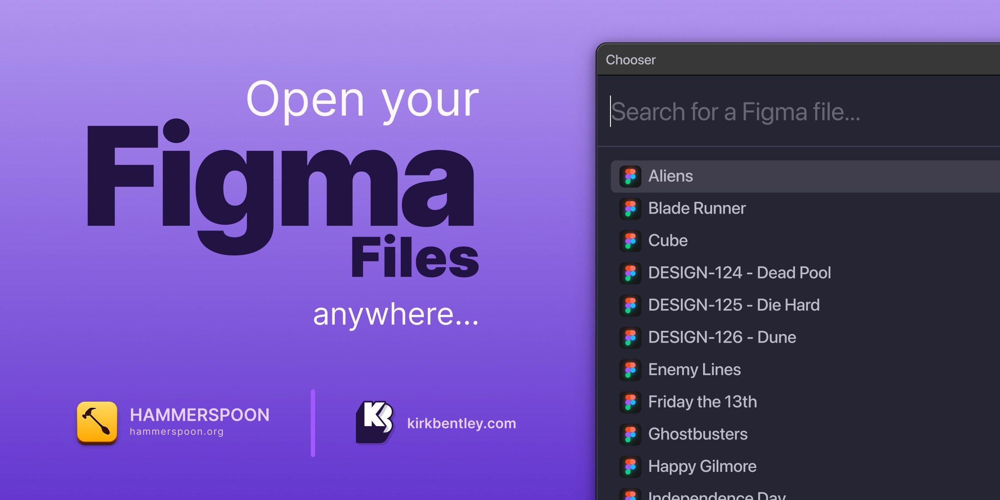

# FigmaFiles.spoon

Unlock instant access to your Figma files with a single shortcut from anywhere on your Mac. No more digging through teams and projects. Whether you're a designer or developer, streamline your workflow and jump into your Figma files effortlessly.

## Installing Spoon

The easiest way to install the Text Transform spoon:

```
mkdir -p ~/.hammerspoon/Spoons
git clone git@github.com:fyrebase/FigmaFiles.spoon.git ~/.hammerspoon/Spoons/FigmaFiles.spoon
```

## Init Spoon

```
hs.loadSpoon("FigmaFiles")

spoon.FigmaFiles.apiKey = "[YOUR_FIGMA_API_KEY]"
spoon.FigmaFiles.teamIds = {[TEAM_ID],[ANOTHER_TEAM_ID]}
spoon.FigmaFiles.darkMode = true
spoon.FigmaFiles.autoUpdate = true
spoon.FigmaFiles.updateCacheInterval = 60*60*3 -- 3 Hours

spoon.FigmaFiles:start()
spoon.FigmaFiles:bindHotKeys({
    showFigmaFilesChooser = {hyper, "f"}
})
```

**Replace `[YOUR_FIGMA_API_KEY]` with your Figma API key.**

You can find out how to generate or revoke a Figma API key [here](https://help.figma.com/hc/en-us/articles/8085703771159-Manage-personal-access-tokens).

**Replace `[TEAM_ID],[ANOTHER_TEAM_ID]` with a comma separated list of the team IDs you wish to be able to search.**

You can obtain the team ID from the Figma desktop app by right clicking on your team and copying the link. You want to copy the ID at the end of the URL - Example: `https://www.figma.com/files/team/[TEAM_ID]`
